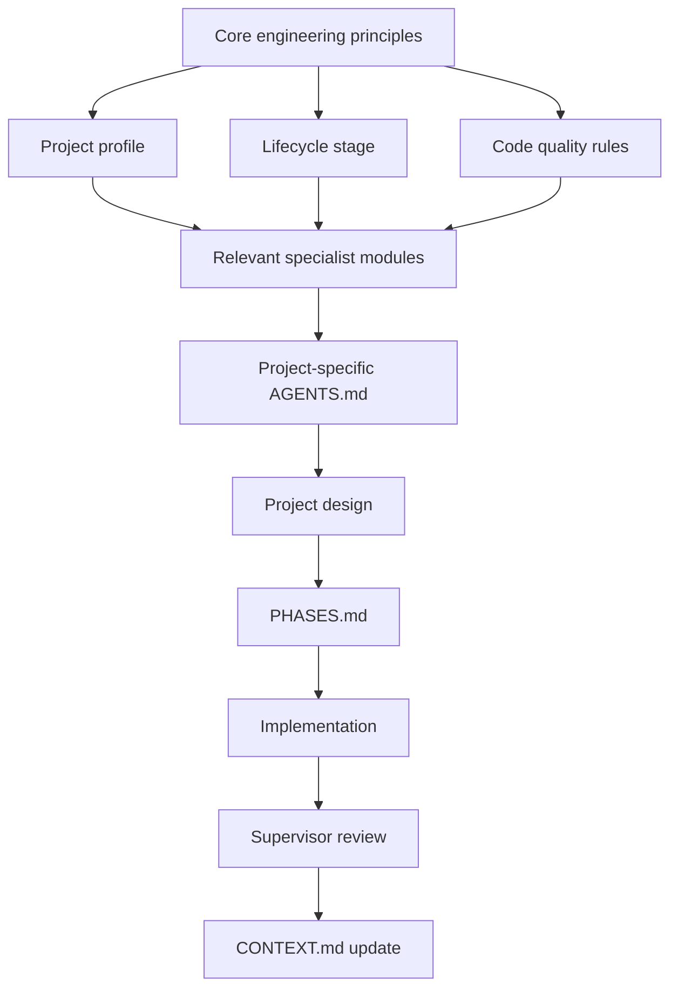

# Engineering Handbook — Guide and Table of Contents

This page is the main reading map for the handbook.

You do not need to read everything before building a project. Start with the **Foundations** section, then use the **Project Profiles**, **Lifecycle Stages**, and **Specialist Modules** that match the product you are building.

---

## 1. How the handbook works

The handbook is layered.



Think of the layers like this:

- **Core rules** = engineering values that apply almost everywhere.
- **Profile** = what kind of product this is.
- **Lifecycle stage** = how mature or critical the product currently is.
- **Specialists** = deeper rules used only when needed.
- **Project files** = the specific decisions for the product being built.

---

# Table of Contents

## Part I — Foundations

1. [`concepts/foundations.md`](./concepts/foundations.md) — beginner-friendly explanations of common software/system concepts.
2. [`concepts/glossary.md`](./concepts/glossary.md) — short definitions of recurring terms.
3. [`AGENTS.md`](./AGENTS.md) — the core engineering constitution.
4. [`architecture/principles.md`](./architecture/principles.md) — architecture principles and tradeoff thinking.
5. [`lifecycle/stages.md`](./lifecycle/stages.md) — experiment, prototype, MVP, production, and high-scale stages.

## Part II — Writing and Organizing Code

6. [`code-quality/clean-code.md`](./code-quality/clean-code.md) — naming, functions, modules, comments, readability, and complexity.
7. [`code-quality/project-structure.md`](./code-quality/project-structure.md) — how to organize files by project size and domain.
8. [`code-quality/dependency-discipline.md`](./code-quality/dependency-discipline.md) — rules for packages and libraries.
9. [`code-quality/defensive-programming.md`](./code-quality/defensive-programming.md) — defend plausible failures without coding for impossible states.

## Part III — Architecture and Scale

10. [`architecture/scaling.md`](./architecture/scaling.md) — vertical/horizontal scaling, concurrency, traffic, and capacity.
11. [`specialists/caching.md`](./specialists/caching.md) — when caching helps and when it hurts.
12. [`specialists/queues-background-jobs.md`](./specialists/queues-background-jobs.md) — async work, retries, and workers.
13. [`specialists/concurrency-locking.md`](./specialists/concurrency-locking.md) — race conditions, locking, optimistic concurrency, and transactions.
14. [`specialists/rate-limiting.md`](./specialists/rate-limiting.md) — abuse control and fairness.
15. [`specialists/observability-slos.md`](./specialists/observability-slos.md) — logs, metrics, tracing, SLI/SLO/SLA.

## Part IV — Backend and APIs

16. [`backend/conventions.md`](./backend/conventions.md) — normal backend layering and request flow.
17. [`specialists/api-versioning.md`](./specialists/api-versioning.md) — compatibility and versioning rules.
18. [`specialists/auth-sessions-jwt.md`](./specialists/auth-sessions-jwt.md) — login, sessions, access tokens, refresh tokens, and revocation.
19. [`specialists/file-uploads.md`](./specialists/file-uploads.md) — file/media handling and storage.

## Part V — Database and Data Integrity

20. [`database/design.md`](./database/design.md) — schema design, constraints, transactions, and migrations.
21. [`specialists/database-indexing-query-optimization.md`](./specialists/database-indexing-query-optimization.md) — indexes, query plans, N+1, pagination, and performance.

## Part VI — Security and Reliability

22. [`security/security.md`](./security/security.md) — authentication, authorization, trust boundaries, secrets, uploads, and admin operations.
23. [`reliability/production.md`](./reliability/production.md) — timeouts, retries, idempotency, failure handling, and production safety.

## Part VII — Money, Payments, and Financial Systems

24. [`finance/money-tax-payments.md`](./finance/money-tax-payments.md) — exact money representation, taxes, payment state, refunds, and provider verification.
25. [`finance/cost-engineering.md`](./finance/cost-engineering.md) — infrastructure and third-party cost thinking.
26. [`specialists/ledger-reconciliation.md`](./specialists/ledger-reconciliation.md) — ledger-first financial state, settlement, reconciliation, reversals, and discrepancies.

## Part VIII — Product Profiles

27. [`profiles/saas.md`](./profiles/saas.md)
28. [`profiles/ecommerce.md`](./profiles/ecommerce.md)
29. [`profiles/fintech.md`](./profiles/fintech.md)
30. [`profiles/marketplace.md`](./profiles/marketplace.md)
31. [`profiles/wallet.md`](./profiles/wallet.md)
32. [`profiles/content-platform.md`](./profiles/content-platform.md)
33. [`profiles/internal-tool.md`](./profiles/internal-tool.md)
34. [`profiles/portfolio-static-site.md`](./profiles/portfolio-static-site.md)
35. [`profiles/mobile-app.md`](./profiles/mobile-app.md)
36. [`profiles/api-only.md`](./profiles/api-only.md)
37. [`profiles/dashboard.md`](./profiles/dashboard.md)

## Part IX — Delivery Workflow

38. [`workflow/git-commits-prs.md`](./workflow/git-commits-prs.md) — branches, commits, pull requests, and review discipline.
39. [`workflow/supervisor-mode.md`](./workflow/supervisor-mode.md) — evidence-based self-review before completion.
40. [`templates/project-design.md`](./templates/project-design.md) — design decisions before implementation.
41. [`templates/PHASES.md`](./templates/PHASES.md) — implementation roadmap from setup to production.
42. [`templates/CONTEXT.md`](./templates/CONTEXT.md) — durable project handoff between agents/chats.
43. [`templates/adr.md`](./templates/adr.md) — architecture decision record.
44. [`checklists/new-project.md`](./checklists/new-project.md) — project startup checklist.
45. [`checklists/production-readiness.md`](./checklists/production-readiness.md) — launch checklist.

---

# Recommended reading paths

## If you are new to system design

Read in this order:

```text
Foundations
   ↓
Architecture principles
   ↓
Backend conventions
   ↓
Database design
   ↓
Authentication
   ↓
Scaling
   ↓
Caching / queues / concurrency
   ↓
Security / reliability
   ↓
Your project profile
```

## If you are starting a new project with an AI agent


## If you are joining an existing project

Read:

1. `AGENTS.md`
2. `docs/CONTEXT.md`
3. `docs/PHASES.md`
4. `docs/project-design.md`
5. relevant ADRs
6. only the handbook modules referenced by that project

---

# Key philosophy

The handbook is not trying to make every project look enterprise-scale.

It is trying to make each project:

- easy to understand;
- conventional;
- correct;
- safe where risk matters;
- efficient enough for its real workload;
- structured enough to grow;
- documented enough that another developer or AI agent can continue the work.

The question is not:

> What is the most advanced architecture we can build?

The question is:

> What is the simplest conventional design that correctly solves the current problem and can evolve when evidence says it should?
