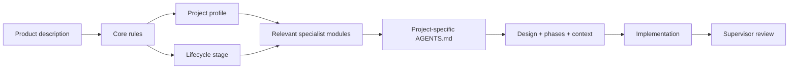

# Engineering Handbook

A practical engineering rulebook for AI coding agents such as **Claude Code, Codex, Cursor, and similar tools**.

Its purpose is simple: help an AI agent build software using conventional, maintainable, production-aware engineering practices without over-engineering the project.

## Quick start

1. Open your project in your coding agent.
2. Open [`BOOTSTRAP_PROMPT.md`](./BOOTSTRAP_PROMPT.md).
3. Replace `WHAT I AM BUILDING` with a normal description of your product.
4. Paste the prompt from the project root.

The agent will inspect the project, choose the relevant product profile, lifecycle stage, and specialist modules, then create the project-specific engineering files before substantial implementation.

Typical generated files:

```text
project/
├── AGENTS.md
├── .engineering/
├── docs/
│   ├── project-design.md
│   ├── PHASES.md
│   ├── CONTEXT.md
│   └── adr/
└── src/
```

## How the handbook works



The layers mean:

- **Core rules** — general engineering standards.
- **Profiles** — extra rules for SaaS, ecommerce, fintech, wallet, marketplace, mobile, APIs, dashboards, and similar products.
- **Lifecycle stage** — experiment, prototype, MVP, production/growth, or high-scale/high-criticality.
- **Specialists** — deeper modules loaded only when relevant, such as caching, queues, auth, concurrency, indexing, observability, or ledger/reconciliation.

## What the handbook enforces

- conventional framework-native solutions first;
- clear project and file structure;
- meaningful naming and maintainable code;
- no arbitrary abstraction layers;
- no unnecessary or unsupported dependencies;
- no excessive defensive programming for impossible internal states;
- database constraints and transactions where they protect real invariants;
- explicit auth and authorization boundaries;
- realistic traffic and scaling assumptions;
- idempotent and auditable payment/money flows;
- persistent `PHASES.md` and `CONTEXT.md` for multi-agent work;
- focused commits and PRs;
- evidence-based supervisor review before substantial work is considered complete.

## Navigation

- [`HANDBOOK.md`](./HANDBOOK.md) — concise table of contents and reading map.
- [`AGENTS.md`](./AGENTS.md) — core engineering constitution.
- [`concepts/glossary.md`](./concepts/glossary.md) — quick definitions for common terms.
- [`profiles/`](./profiles/) — product-specific rules.
- [`lifecycle/`](./lifecycle/) — stage-specific expectations.
- [`specialists/`](./specialists/) — deeper technical guidance.
- [`code-quality/`](./code-quality/) — code structure, dependencies, and defensive-programming rules.
- [`workflow/`](./workflow/) — supervisor mode, Git, commits, and PRs.
- [`templates/`](./templates/) — project design, phases, context, and ADR templates.

## Core philosophy

> Build the simplest conventional system that correctly solves today's problem, protects important invariants, and leaves a sensible path for tomorrow.

Production-ready does not automatically mean microservices, Redis, Kafka, Kubernetes, or multiple databases. Add complexity only when a concrete requirement or measured constraint justifies it.
