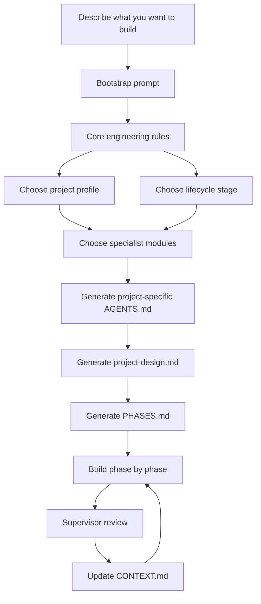
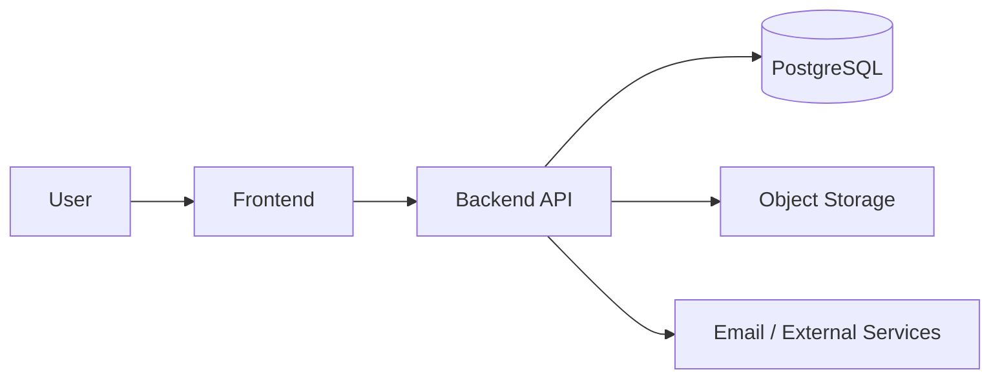
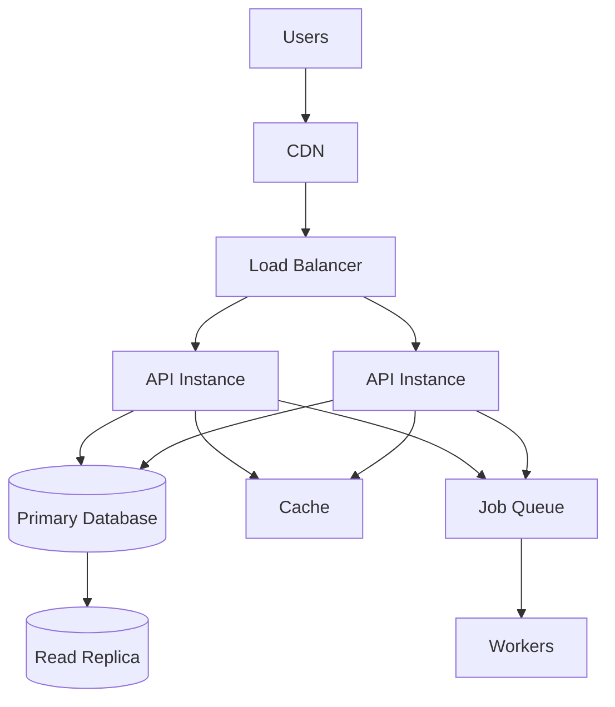
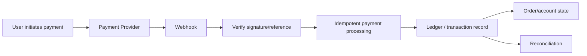

# Engineering Handbook

A practical, beginner-friendly engineering handbook for building software with AI coding agents such as **Claude Code, Codex, Cursor, and similar tools**.

It is designed to answer two questions:

1. **How should this product be engineered?**
2. **How do we make an AI agent follow good engineering practices throughout the whole project?**

The handbook covers system design, software architecture, code quality, databases, APIs, authentication, scalability, traffic, concurrency, security, reliability, testing, payments, money movement, project structure, Git workflow, project phases, multi-agent context, and production readiness.

The goal is not to make every project look like Netflix or Stripe.

The goal is to build **clear, conventional, maintainable software that is as simple as possible and as sophisticated as necessary**.

---

## Start here

If you are learning, start with:

- **[Handbook Table of Contents](./HANDBOOK.md)**
- **[Foundations: System Design Concepts Explained Simply](./concepts/foundations.md)**
- **[Glossary](./concepts/glossary.md)**

If you just want your AI agent to set up a project using the handbook:

- **[Copy the Bootstrap Prompt](./BOOTSTRAP_PROMPT.md)**

---

## How the handbook fits together



### Core rules

Rules that almost every project should follow: clarity, conventional architecture, database integrity, security boundaries, sensible dependencies, clean code, testing, and documented tradeoffs.

### Project profile

Describes the **type of product** being built.

Examples:

- SaaS
- ecommerce
- fintech
- marketplace
- wallet
- mobile app
- dashboard
- API-only service

A product may use several profiles at once.

### Lifecycle stage

Describes **how mature the product currently is**.

```text
Experiment → Prototype → MVP → Production/Growth → High Scale/Criticality
```

A prototype should not be forced to carry the same operational complexity as a mature production platform.

However, lifecycle stage does not weaken correctness in high-risk areas. A small MVP that handles real money still needs correct financial logic.

### Specialist modules

Deeper engineering guidance loaded only when relevant.

Examples include:

- caching;
- queues;
- concurrency;
- rate limiting;
- API versioning;
- file uploads;
- sessions/JWTs;
- observability/SLOs;
- database indexing;
- ledger/reconciliation.

---

# Quick Start for AI-Assisted Projects

You do **not** need to manually configure every rule.

Open your project in Claude Code, Codex, Cursor, or another coding agent and copy the prompt from:

**[`BOOTSTRAP_PROMPT.md`](./BOOTSTRAP_PROMPT.md)**

Then describe your product normally.

Example:

```text
WHAT I AM BUILDING:

I want to build a multi-tenant school management platform.
Schools should manage students, teachers, classes, attendance,
results, fees and announcements.

There will be school admins, teachers, parents and students.
Each school must only access its own data.

I want Node.js, Express, TypeScript and PostgreSQL.
The first release will have a small number of schools,
but I want the codebase to remain maintainable as it grows.
```

The agent should then:

```mermaid
flowchart LR
    A[Inspect project] --> B[Choose profiles]
    B --> C[Choose lifecycle stage]
    C --> D[Select specialist rules]
    D --> E[Create AGENTS.md]
    E --> F[Create project design]
    F --> G[Create phases]
    G --> H[Create context handoff]
    H --> I[Wait for design approval]
```



It should **not** immediately generate thousands of lines of code.

---

# What gets created inside a project

A serious project using the handbook should usually contain:

```text
project/
├── AGENTS.md
├── .engineering/
│   └── engineering-handbook
│
├── docs/
│   ├── project-design.md
│   ├── PHASES.md
│   ├── CONTEXT.md
│   └── adr/
│
└── src/
```

## `AGENTS.md`

The project-specific instructions for the coding agent.

It should stay concise and reference the relevant handbook sections rather than copying the whole handbook.

## `project-design.md`

Explains what is being built and why major engineering decisions were made.

It covers things such as:

- users and roles;
- architecture;
- data model;
- authentication;
- permissions;
- expected traffic;
- security;
- money/payment rules;
- infrastructure cost;
- tradeoffs;
- scaling triggers.

## `PHASES.md`

The living implementation roadmap.

Example:

```text
Phase 1 — Product and architecture
Phase 2 — Database/auth foundations
Phase 3 — Core workflows
Phase 4 — Integrations
Phase 5 — Security/reliability hardening
Phase 6 — QA and production readiness
Phase 7 — Launch
```

Agents update the file as work progresses instead of relying on chat memory.

## `CONTEXT.md`

The durable handoff file for:

- starting a new AI chat;
- switching between Claude Code and Codex;
- bringing another developer into the project;
- resuming work after a long break.

It contains the current state, decisions, verified tests, active task, assumptions, risks, and next actions.

---

# A simple picture of a normal web system

Before thinking about complex infrastructure, most products begin roughly like this:



As real requirements appear, the architecture may evolve:



The handbook's rule is:

> Do not jump to the second diagram until a real requirement justifies each additional component.

---

# Major handbook areas

The full navigation lives in **[HANDBOOK.md](./HANDBOOK.md)**, but the major sections are:

| Area | What it teaches |
|---|---|
| Foundations | APIs, middleware, databases, transactions, caching, queues, auth, scaling, concurrency, webhooks, metrics and other core concepts |
| Architecture | How to choose system boundaries and make tradeoffs |
| Code Quality | Naming, functions, modules, formatting, complexity, defensive programming and dependencies |
| Backend | Request flow, controllers/services, APIs and conventions |
| Database | Schema design, constraints, migrations, transactions, indexes and query optimization |
| Security | Authentication, authorization, trust boundaries, uploads, secrets and abuse controls |
| Reliability | Timeouts, retries, idempotency, failure handling and recovery |
| Scalability | Traffic, concurrency, capacity, load balancing and scaling strategies |
| Finance | Money representation, payments, refunds, tax boundaries, ledgers and reconciliation |
| Workflow | Commits, PRs, phases, context handoff and supervisor review |
| Profiles | Rules tailored to ecommerce, SaaS, fintech, wallet, marketplace, mobile and other product types |
| Lifecycle | Different expectations for prototypes, MVPs, production and high-scale systems |

---

# Design principles the handbook strongly enforces

The handbook pushes AI agents toward these behaviors:

- prefer framework-native and widely understood solutions;
- use meaningful variable, function, module and file names;
- keep functions/modules cohesive rather than chasing arbitrary line-count limits;
- do not hide programmer mistakes behind excessive defensive fallbacks;
- do not install packages when the platform or an existing dependency already solves the problem cleanly;
- avoid unsupported or abandoned libraries;
- use database constraints for real data invariants;
- treat authentication and authorization as separate concerns;
- distinguish total users, active users, concurrent users and requests per second;
- add caching only when repeated work is actually expensive;
- add queues only when asynchronous processing solves a real problem;
- make retryable operations idempotent where necessary;
- treat payments and money movement as auditable state transitions;
- never guess jurisdiction-specific tax or compliance rules;
- document meaningful tradeoffs;
- create focused commits and reviewable PRs;
- maintain project context outside chat;
- use supervisor review without creating endless AI refactor loops.

---

# Money and financial systems

Financial systems get stricter rules.

A basic financial flow may look like:



The handbook covers:

- exact monetary representation;
- currency handling;
- payment states;
- refunds;
- reversals;
- settlement;
- fees;
- payout flows;
- immutable ledger history;
- reconciliation;
- duplicate/delayed webhooks;
- concurrency around balances;
- provider references;
- tax/accounting inputs;
- auditability.

For wallets and fintech systems, financial correctness takes priority over convenience.

---

# Clean code without dogma

The handbook does **not** enforce rules like:

```text
Every function must be < 20 lines.
Every file must be < 200 lines.
Every database call needs a repository class.
Every project needs dependency injection.
```

Instead it asks:

- Does this function have one coherent purpose?
- Does this module contain unrelated responsibilities?
- Is this abstraction solving a real problem?
- Can a normal developer understand this code quickly?
- Is complexity justified by requirements?

A long function is a signal to inspect, not automatic proof of bad code.

---

# Repository map

```text
engineering-handbook/
├── README.md                 # Entry point
├── HANDBOOK.md               # Full table of contents / reading map
├── BOOTSTRAP_PROMPT.md       # Copy-paste setup prompt
├── AGENTS.md                 # Core engineering constitution
│
├── concepts/                 # Beginner foundations and glossary
├── lifecycle/                # Prototype → production maturity rules
├── profiles/                 # SaaS, ecommerce, fintech, wallet, etc.
├── specialists/              # Deep technical modules
├── code-quality/             # Code and dependency rules
├── workflow/                 # Supervisor, Git, PR workflow
├── architecture/
├── backend/
├── database/
├── finance/
├── product/
├── reliability/
├── security/
├── testing/
├── checklists/
├── templates/
└── SOURCES.md
```

---

# Where to go next

If you want to **learn the concepts**, go to:

**[Foundations →](./concepts/foundations.md)**

If you want to **browse everything**, go to:

**[Full Handbook Table of Contents →](./HANDBOOK.md)**

If you want to **use it immediately with an AI agent**, go to:

**[Bootstrap Prompt →](./BOOTSTRAP_PROMPT.md)**

---

## Philosophy

Good engineering is not about using the most technology.

It is about understanding the problem, protecting the important invariants, choosing reasonable tradeoffs, and keeping the system understandable as it evolves.

> Build the simplest conventional system that correctly solves today's problem and leaves a sensible path for tomorrow.
