# Foundations — System Design and Software Engineering Concepts

This chapter explains the smaller concepts that appear throughout the handbook. It is intentionally beginner-friendly.

---

## 1. What is system design?

System design is the process of deciding **how a software system should be organized so it can meet its requirements**.

It answers questions such as:

- What parts does the system need?
- How should those parts communicate?
- Where should data live?
- How do users authenticate?
- What happens if one part fails?
- How much traffic should it handle?
- How do we keep the system secure?
- How do we scale it later?
- How much will it cost to run?

A simple web app might look like this:

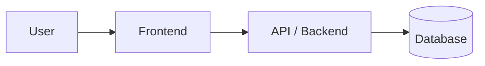

That is already a system design.

System design is not automatically about microservices, Kubernetes, or huge traffic. It starts with choosing the simplest structure that solves the current problem.

---

## 2. What is software architecture?

Software architecture is the **high-level structure of a software system**.

It focuses on major components, boundaries, responsibilities, and relationships.

Example:

```text
Frontend
   ↓
Backend API
   ↓
Database
   ↓
External payment provider
```

Architecture is about questions like:

- Should the system be one application or several services?
- Where should business logic live?
- Should files go in the database or object storage?
- Which components are allowed to depend on each other?
- Where are the trust boundaries?

Architecture is not the same thing as folder naming, though folder structure often reflects architecture.

---

## 3. What is a monolith?

A monolith is an application where most business capabilities live in one deployable application.

Example:

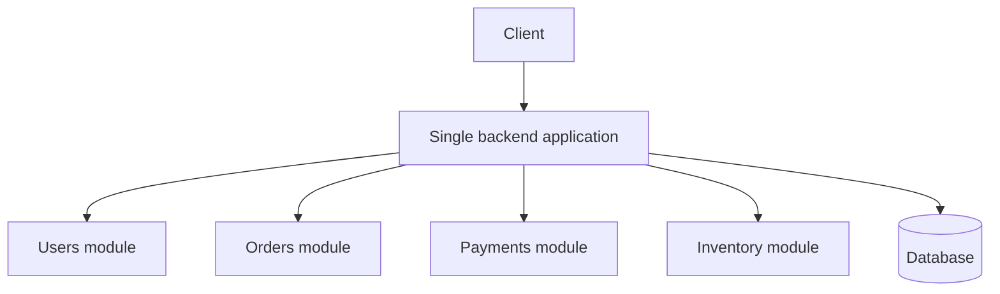

A monolith is not automatically bad.

For many products, a well-structured monolith is the best starting point because it is easier to:

- develop;
- test;
- deploy;
- debug;
- operate;
- understand.

A **modular monolith** keeps clear internal module boundaries while remaining one deployable application.

---

## 4. What are microservices?

Microservices split a system into multiple independently deployable services.

Example:

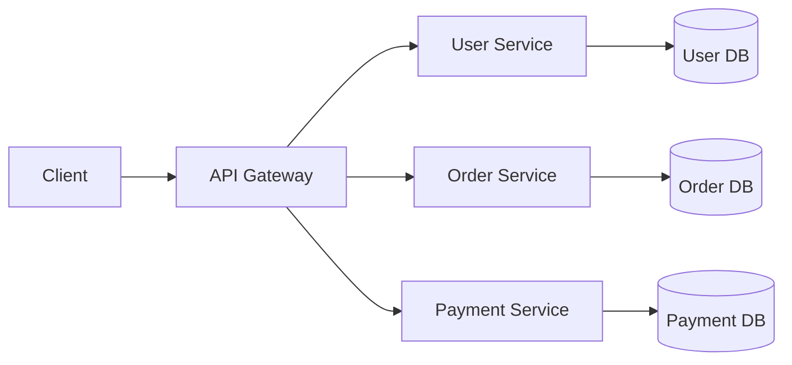

Microservices can help when different parts of a large system genuinely need independent ownership, deployment, or scaling.

They also introduce extra complexity:

- network failures;
- service-to-service authentication;
- distributed tracing;
- more deployments;
- data consistency problems;
- versioning between services;
- higher operational cost.

Do not choose microservices merely because a product may become large someday.

---

## 5. What is an API?

An API is a defined way for one piece of software to communicate with another.

For a web application, the frontend might call:

```text
GET /api/products
```

The backend returns product data.

An API defines things such as:

- available operations;
- request format;
- response format;
- authentication requirements;
- errors;
- versioning.

---

## 6. What is an endpoint?

An endpoint is one specific API address and operation.

Examples:

```text
GET    /api/products
GET    /api/products/:id
POST   /api/orders
PATCH  /api/users/:id
DELETE /api/sessions/current
```

You can think of the API as a restaurant and endpoints as the individual items on its menu.

---

## 7. What are routes, controllers, services, and repositories?

These are common backend responsibilities.

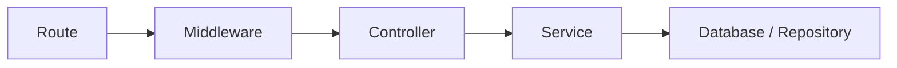

### Route

Matches an incoming request to application code.

Example:

```text
POST /api/orders
```

### Middleware

Runs before or around the main request handler.

Common uses:

- authentication;
- authorization;
- validation;
- rate limiting;
- request logging.

### Controller

Handles HTTP-specific concerns.

It usually:

- reads request parameters;
- calls business logic;
- returns an HTTP response.

### Service

Contains business rules or orchestration.

Example:

```text
placeOrder()
```

may validate inventory, calculate totals, create an order, and trigger payment initialization.

### Repository / Data access layer

Encapsulates database access when a separate persistence boundary is actually useful.

Not every tiny project needs every layer.

---

## 8. What is a database?

A database stores persistent application data.

Examples:

- users;
- products;
- orders;
- payments;
- messages.

Persistent means the data survives after the application process stops.

---

## 9. What is a relational database?

A relational database stores data in tables with defined relationships.

Example:

```text
users
- id
- email

orders
- id
- user_id
- total
```

`orders.user_id` links an order to a user.

PostgreSQL and MySQL are common relational databases.

Relational databases are especially useful when data has strong relationships and transactional rules.

---

## 10. What is a schema?

A database schema describes how data is structured.

It defines:

- tables;
- columns;
- data types;
- relationships;
- constraints;
- indexes.

Think of it as the blueprint for the database.

---

## 11. What is a database constraint?

A constraint is a rule enforced by the database.

Examples:

- `NOT NULL` — a value must exist;
- `UNIQUE` — duplicates are forbidden;
- `FOREIGN KEY` — a relationship must reference valid data;
- `CHECK` — a value must satisfy a rule.

Constraints prevent invalid data even if application code contains a bug.

---

## 12. What is an index?

A database index is a data structure that helps the database find rows faster.

Without an index, the database may need to inspect many rows.

Example query:

```sql
SELECT * FROM users WHERE email = ?;
```

An index on `email` can make this much faster.

But indexes also:

- consume storage;
- increase write cost;
- require maintenance.

So indexes should match real query patterns.

---

## 13. What is a transaction?

A database transaction groups multiple operations into one atomic unit.

Imagine transferring money:

```text
1. subtract ₦5,000 from A
2. add ₦5,000 to B
```

Both should succeed or neither should succeed.

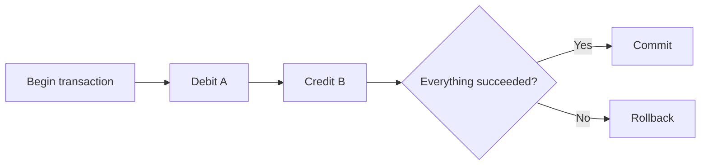

Transactions protect data integrity.

---

## 14. What is authentication?

Authentication answers:

> Who are you?

Examples:

- password login;
- magic link;
- passkey;
- OAuth login;
- API key.

Authentication proves identity.

---

## 15. What is authorization?

Authorization answers:

> What are you allowed to do?

A logged-in user may still not be allowed to:

- delete another user's account;
- access admin pages;
- refund an order;
- manage staff.

Authentication and authorization are different problems.

---

## 16. What is RBAC?

RBAC means **Role-Based Access Control**.

Permissions are assigned to roles.

Example:

```text
Customer
- create order
- view own orders

Staff
- view orders
- update fulfillment

Manager
- manage products
- manage staff
- view analytics
```

Then users receive roles.

RBAC works well when permissions naturally group by job responsibility.

---

## 17. What is a session?

A session represents an authenticated login over time.

The server may keep session state in a database/cache and send the browser a session identifier in a secure cookie.

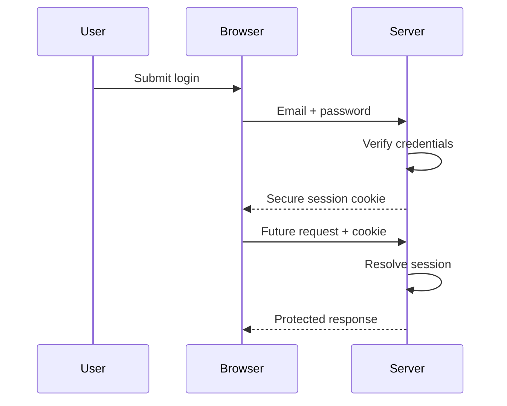

---

## 18. What is a JWT?

JWT stands for JSON Web Token.

It is a signed token format often used to carry identity/claims.

A JWT is not automatically better than sessions.

Important properties:

- signatures protect integrity, not secrecy;
- tokens usually have an expiry;
- revocation can be harder than server-side sessions;
- sensitive data should not be placed inside simply because the token is signed.

---

## 19. What is a refresh token?

A refresh token is a longer-lived credential used to obtain a new short-lived access token.

Typical flow:

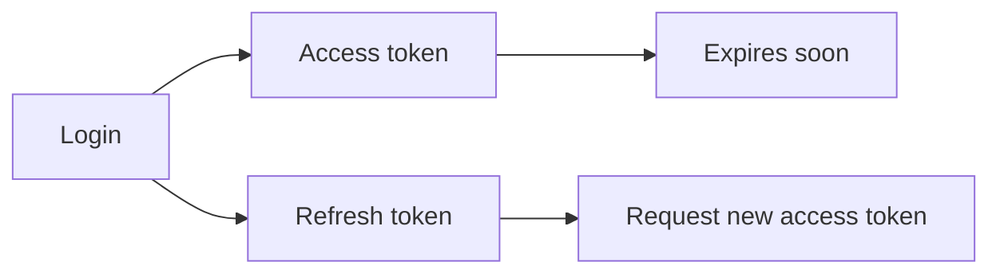

Refresh tokens require careful storage, rotation, and revocation rules.

---

## 20. What is caching?

Caching stores a temporary copy of data so repeated work can be avoided.

Example:

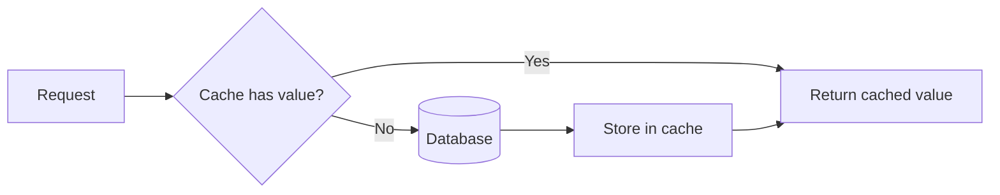

Caching can improve performance, but introduces staleness and invalidation problems.

Do not cache automatically. First identify what is actually expensive.

---

## 21. What is a queue?

A queue stores work that should be processed asynchronously.

Useful examples:

- sending emails;
- generating reports;
- image processing;
- retrying webhooks;
- importing large files.

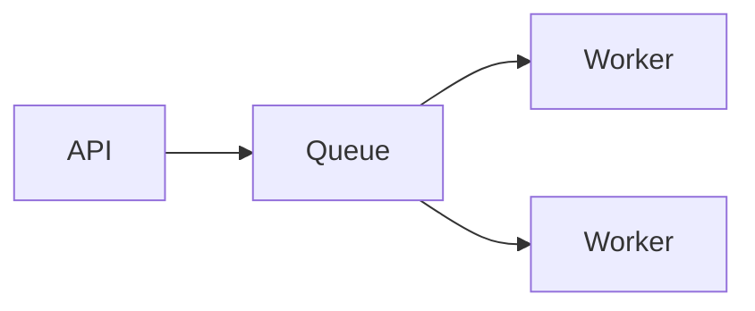

The request can finish while workers handle slower jobs later.

---

## 22. What is idempotency?

An operation is idempotent when repeating the same request does not create unwanted duplicate effects.

Example problem:

A user clicks **Pay** twice because the first request looks slow.

Bad result:

```text
charge #1
charge #2
```

With an idempotency key:

```text
same payment attempt
→ same logical result
```

Idempotency is especially important for:

- payments;
- transfers;
- order creation;
- webhook processing;
- retryable jobs.

---

## 23. What is concurrency?

Concurrency means multiple operations may be happening during overlapping periods.

Example:

Two users attempt to buy the final item at almost the same time.

```text
Stock = 1

Request A reads 1
Request B reads 1
A purchases
B purchases
```

Without proper concurrency control, stock could become invalid.

Solutions may involve:

- transactions;
- row locks;
- optimistic concurrency;
- unique constraints;
- atomic updates.

---

## 24. What is a race condition?

A race condition happens when correctness depends on the timing/order of concurrent operations.

The final stock example above is a race condition.

A good system should preserve the invariant regardless of which request arrives first.

---

## 25. What is rate limiting?

Rate limiting controls how frequently a client can perform an action.

Examples:

```text
login: 10 attempts / 10 minutes
password reset: 3 requests / hour
API key: 1000 requests / minute
```

Reasons include:

- abuse prevention;
- brute-force protection;
- fairness;
- cost control;
- service protection.

---

## 26. What is load balancing?

A load balancer distributes incoming traffic across multiple application instances.

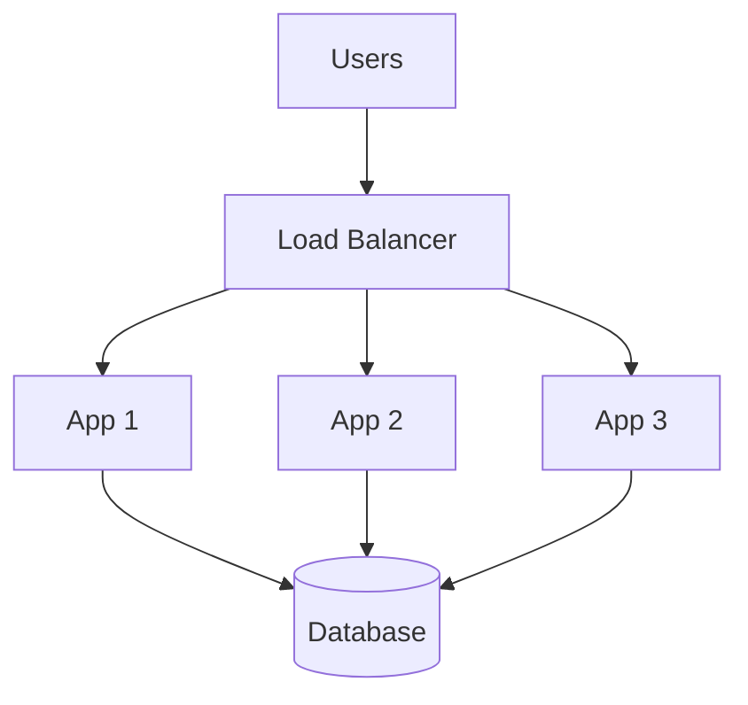

This is commonly used when one application instance is not enough or high availability is required.

---

## 27. Vertical vs horizontal scaling

### Vertical scaling

Make one machine more powerful.

```text
4 GB RAM → 16 GB RAM
2 CPU → 8 CPU
```

Simple, but there is a physical/economic limit.

### Horizontal scaling

Add more machines/instances.

```text
1 API server → 4 API servers
```

More flexible, but it requires the application to handle distributed execution correctly.

---

## 28. Total users vs active users vs concurrent users

These metrics are not the same.

### Registered users
All accounts ever created.

### DAU
Daily Active Users.

Users who actually use the product in one day.

### Concurrent users
Users actively using the system at approximately the same time.

A system may have:

```text
1,000,000 registered users
100,000 DAU
4,000 peak concurrent users
```

Architecture should not be chosen from the first number alone.

---

## 29. What is RPS?

RPS means **Requests Per Second**.

It estimates traffic load on the backend.

If 500 concurrent users each make one request every 10 seconds:

```text
500 / 10 ≈ 50 RPS
```

Peak RPS is usually more useful than daily averages when planning capacity.

---

## 30. What are logs, metrics, and traces?

These are three common observability signals.

### Logs

Records of individual events.

Example:

```text
order 492 payment verification failed
```

### Metrics

Numeric measurements over time.

Examples:

```text
requests per second
error rate
p95 latency
CPU usage
```

### Traces

Show how one request moves through multiple components.

Useful when a request touches several services or dependencies.

---

## 31. What is latency?

Latency is how long an operation takes.

Example:

```text
API response = 120 ms
```

Percentiles are often more informative than averages.

```text
p50 = half of requests are faster than this
p95 = 95% are faster than this
p99 = 99% are faster than this
```

---

## 32. What are SLI, SLO, and SLA?

### SLI — Service Level Indicator

The actual measured reliability indicator.

Example:

```text
successful request percentage
```

### SLO — Service Level Objective

The target.

```text
99.9% successful requests per month
```

### SLA — Service Level Agreement

A contractual promise to customers, often with consequences if the target is missed.

---

## 33. What is a webhook?

A webhook is an HTTP request sent from one system to another when an event happens.

Example payment flow:

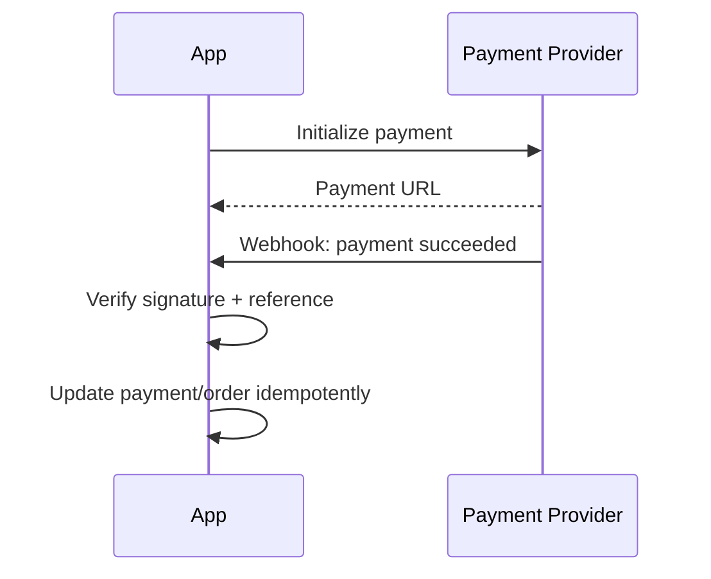

Webhooks can arrive late, duplicated, or out of order. Design accordingly.

---

## 34. What is object storage?

Object storage is designed for files/blobs such as:

- images;
- videos;
- PDFs;
- backups.

Examples include S3-compatible storage and managed storage services.

Usually store file metadata in the database while storing the actual file in object storage.

---

## 35. What is a CDN?

A CDN caches content at locations closer to users.

Useful for:

- images;
- CSS/JavaScript bundles;
- videos;
- static pages.

It can reduce latency and origin bandwidth.

---

## 36. What is soft delete vs hard delete?

### Hard delete

The database row is physically removed.

### Soft delete

The row remains but is marked deleted, for example:

```text
deleted_at = timestamp
```

Soft delete is useful when recovery, audit history, or relationships matter.

But it also complicates queries and uniqueness rules, so it should not be used automatically.

---

## 37. What is a migration?

A migration is a version-controlled change to the database schema.

Example:

```text
001_create_users
002_add_orders
003_add_order_status_index
```

Migrations allow environments and teammates to evolve the database consistently.

---

## 38. What is a deployment?

Deployment means making a new application version available in an environment.

Typical environments:

```text
local → development → staging → production
```

Not every small project needs all four, but production systems should have a controlled path for releasing changes.

---

## 39. What is rollback?

Rollback means returning to a previous known-good version after a bad deployment.

Application rollback can be straightforward.

Database rollback may be harder because data/schema changes can be irreversible.

This is why database migrations need extra care.

---

## 40. What is a tradeoff?

A tradeoff means gaining one benefit while accepting another cost.

Example:

```text
Cache
+ faster reads
+ lower DB pressure
- stale data risk
- invalidation complexity
- extra infrastructure
```

Good system design is mostly about choosing acceptable tradeoffs rather than discovering a perfect solution.
