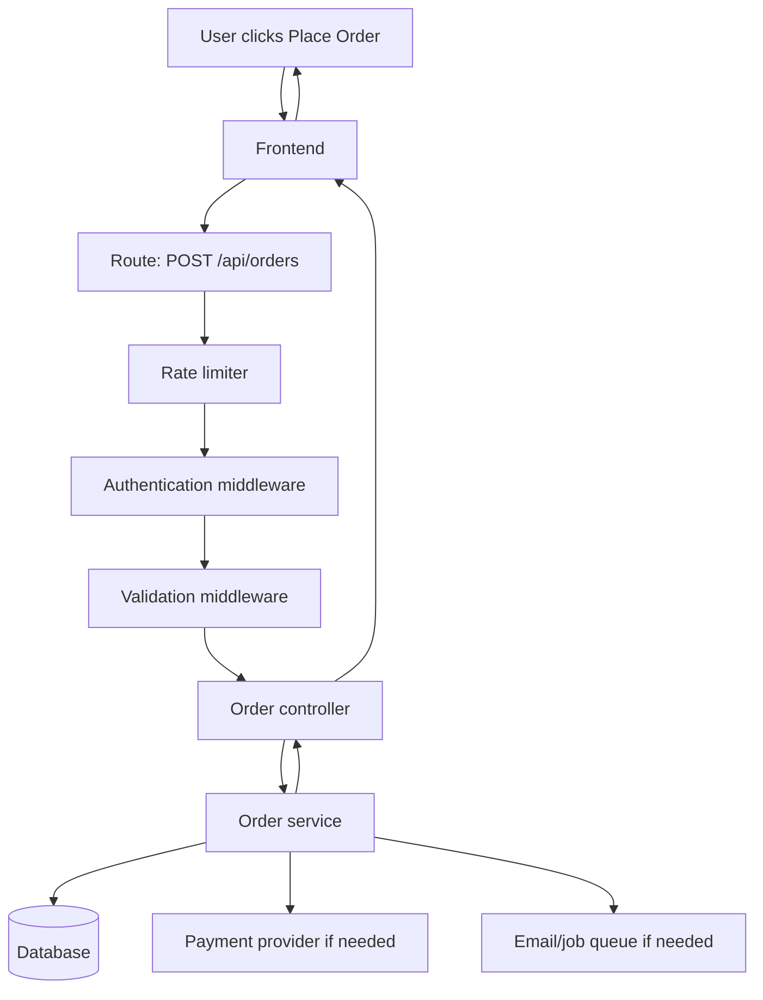
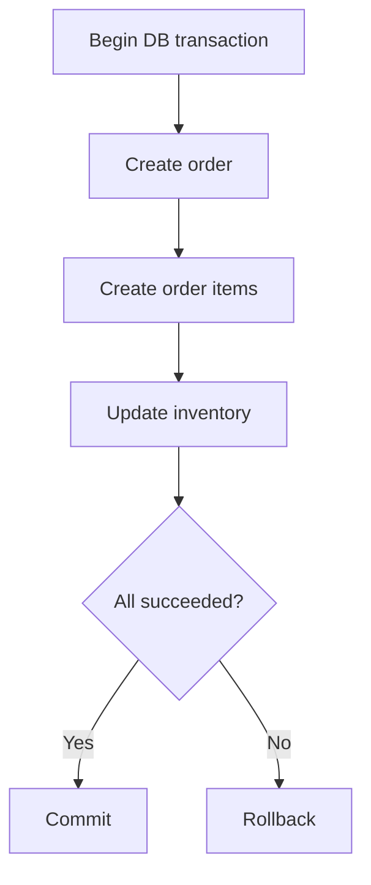
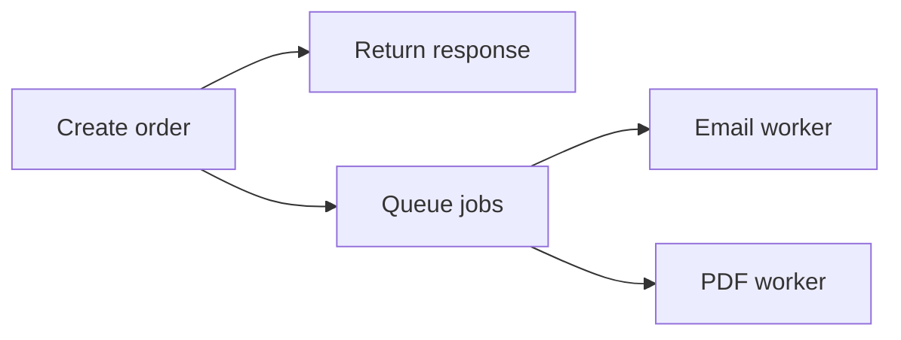
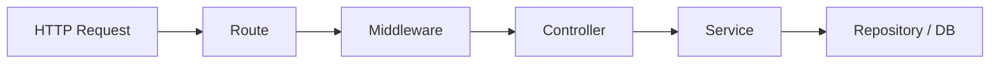
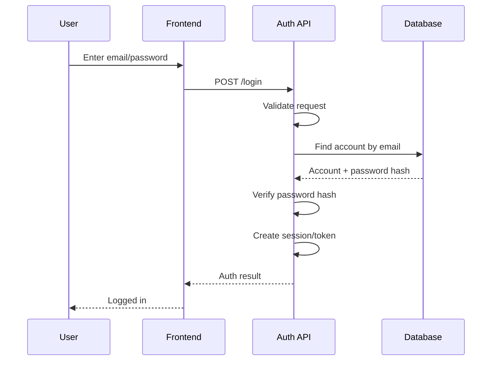
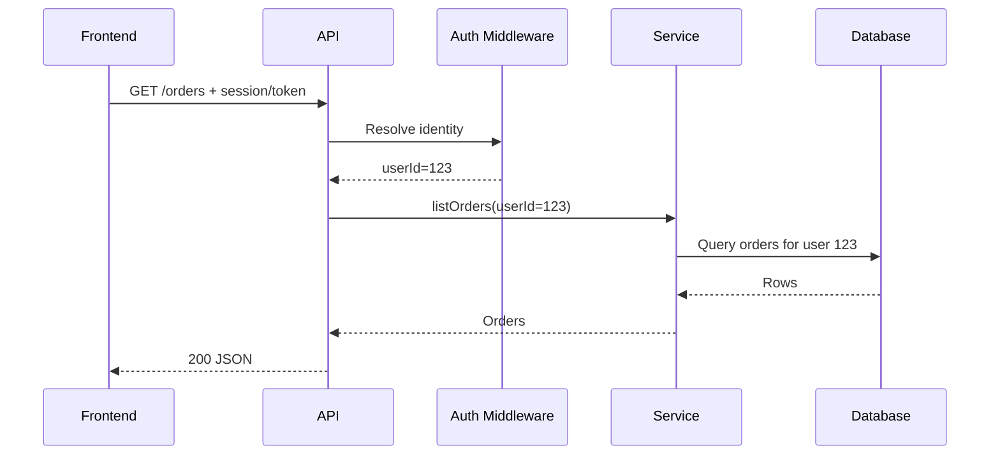

# How a Web Request Moves Through an Application

This chapter explains what actually happens when a user clicks a button and the frontend calls a backend API.

Understanding this flow makes concepts such as routes, middleware, controllers, services, authentication, validation, database queries, and errors much easier to connect.

---

## Example

A customer clicks **Place Order**.

The frontend sends:

```http
POST /api/orders
Authorization: Bearer <token>
Content-Type: application/json
```

with data such as:

```json
{
  "shippingAddressId": 42
}
```

A conventional backend might process it like this:



Each part has a different responsibility.

---

# Step 1 — The frontend sends a request

The frontend should provide the information needed to perform the operation.

It should **not** be trusted to make security decisions.

For example, the frontend might send:

```json
{
  "productId": 10,
  "quantity": 2
}
```

But it should not be trusted to decide:

```json
{
  "price": 100,
  "isAdmin": true,
  "discountPercentage": 90
}
```

when those values are controlled by server-side business rules.

The browser is an untrusted client.

---

# Step 2 — The route matches the request

The route connects an HTTP method/path to the application handler.

Example conceptually:

```text
POST /api/orders
        ↓
create order handler
```

The route should usually remain simple.

Its job is mostly to declare:

- path;
- HTTP method;
- middleware;
- final controller/handler.

Avoid putting large amounts of business logic directly inside route definitions.

---

# Step 3 — Middleware handles cross-cutting concerns

Middleware is useful when the same concern applies to many requests.

Common middleware includes:

```text
request logging
     ↓
rate limiting
     ↓
authentication
     ↓
authorization
     ↓
validation
     ↓
controller
```

## Authentication middleware

Determines who is making the request.

It may resolve:

```text
userId = 123
sessionId = abc
roles = [customer]
```

Authentication does not automatically mean the user is allowed to perform the action.

---

## Authorization middleware

Checks whether that authenticated identity has permission.

Example:

```text
User is authenticated
        ↓
Is user allowed to refund orders?
        ↓
Yes → continue
No  → 403 Forbidden
```

---

## Validation middleware

Checks whether external input has the expected shape.

Examples:

```text
quantity must be a positive integer
email must be valid
page must be >= 1
file size must be under configured limit
```

Validation protects the application's trust boundary.

---

# Step 4 — The controller handles HTTP concerns

A controller sits between HTTP and business logic.

It commonly does four things:

```text
read request
      ↓
call service
      ↓
translate result/error
      ↓
return HTTP response
```

Example responsibility:

```text
createOrderController
```

should not need to know every SQL query used to create an order.

It should be focused on the API interaction.

---

# Step 5 — The service applies business rules

The service usually contains or coordinates the real business operation.

For `placeOrder`, it may need to:

1. load the user's cart;
2. check product availability;
3. calculate authoritative prices;
4. calculate discounts;
5. calculate shipping;
6. create the order;
7. reserve/decrement stock;
8. create payment state;
9. enqueue confirmation work.

This is where business invariants matter.

For example:

```text
An order total must equal the authoritative sum
of its items, discounts, shipping, fees, and tax.
```

The frontend should not be responsible for preserving that invariant.

---

# Step 6 — The database protects persistent state

The service talks to the database directly or through a repository/data-access layer.

For multi-step operations, a transaction may be needed.

Example:



Without a transaction, a failure halfway through could leave incomplete state.

---

# Step 7 — External services are different from database transactions

Suppose order creation also calls a payment provider.

You cannot normally include a remote payment API inside the same database transaction in the same way as local SQL statements.

A dangerous flow would be:

```text
BEGIN DATABASE TRANSACTION
↓
lock rows
↓
call payment provider over internet
↓
wait 8 seconds
↓
commit
```

That may hold database locks while waiting on a slow network dependency.

Instead, financial workflows often use explicit states.

Example:

```text
order = pending_payment
        ↓
initialize provider payment
        ↓
provider processes payment
        ↓
verified webhook / verification call
        ↓
order = paid
```

This is a state machine rather than one giant transaction.

---

# Step 8 — Background work may happen after the request

Some work does not need to block the user's response.

Examples:

- email receipt;
- image processing;
- analytics event;
- PDF generation;
- large export.

Instead of:

```text
request
↓
create order
↓
send email and wait
↓
generate PDF and wait
↓
return response
```

we can use:



Only introduce a queue when asynchronous work actually justifies its complexity.

---

# Step 9 — Errors should be translated intentionally

Different failures mean different things.

Examples:

```text
400 Bad Request
Input is malformed.

401 Unauthorized
No valid authentication.

403 Forbidden
Authenticated, but not allowed.

404 Not Found
Requested resource does not exist or should not be exposed.

409 Conflict
Request conflicts with current state.

422 Unprocessable Entity
Structurally valid request violates domain validation.

429 Too Many Requests
Rate limit exceeded.

500 Internal Server Error
Unexpected server failure.

502/503
Upstream dependency/service unavailable depending on context.
```

The client should not receive raw database errors or stack traces.

---

# Step 10 — Observability records what happened

While the request runs, production systems may record:

### Log

```text
order.create failed payment_provider_timeout
```

### Metric

```text
order_create_latency_ms
payment_provider_error_rate
```

### Trace

```text
request
├── authentication 4ms
├── cart query 12ms
├── inventory query 18ms
├── payment provider 410ms
└── response
```

These help explain failures and performance issues.

---

# A clean separation of responsibilities

A common conventional flow is:



Think of it like this:

| Layer | Main question |
|---|---|
| Route | Which handler should receive this request? |
| Middleware | Is the request valid/safe/allowed to continue? |
| Controller | How do I translate HTTP into a business operation? |
| Service | What should the business operation actually do? |
| Data layer | How do I read/write persistent data safely? |

Not every application needs a separate file/layer for each box.

The important thing is **separation of responsibilities**, not ceremonial architecture.

---

# Example: login request



Important detail:

The database stores a **password hash**, not the plain password.

---

# Example: authenticated request



The backend scopes the database query using the authenticated user identity. It does not trust a user-supplied `userId` to determine ownership.

---

# Final mental model

When a request reaches your backend, think:

```text
WHO is asking?
↓
ARE they allowed?
↓
IS the input valid?
↓
WHAT business operation should happen?
↓
WHAT invariants must remain true?
↓
WHAT persistent state changes?
↓
WHAT external dependencies can fail?
↓
WHAT response should the client receive?
↓
HOW would we diagnose this later if it fails?
```

That sequence is the foundation of a large amount of backend and system-design reasoning.
